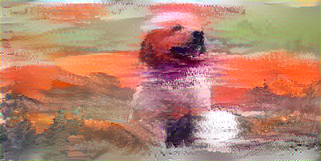
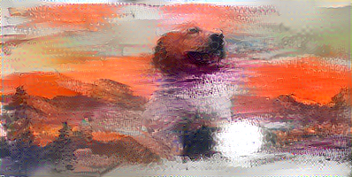

# Neural Style Transfer!

Implemented a  Neural Style Transfer  using **Tensorflow, Keras** and **StreamLit**. This project shows how a a neural network transforms the source image to target image at  multiple iterations. 
# Steps
1. User must select the target image  and a source image like a painting, design etc. 
2. Then select the epoch for how many times the model should run and at what iterations the converted image must be shown. And then click "Start" button.

## Requirements

TensorFlow = 2.1.0
Keras = 2.3.1
StreamLit = 0.70.0

To download use: `pip install requirement.txt`

## Source & Target Image
<table>
  <tr>
    <th> Source Image </th>
    <th> Target Image </th>
  </tr>
  <tr>
  <td>
    
  </td>
  <td>
    
  </td>
  </tr>
</table>

## Images Generated At Different Epochs
<table>
  <tr>
    <td>
      <h6> Image At Iteration 0 </h6>
    
    </td>
    <td>
    <h6> Image At Iteration 100 </h6>
    
    </td>
  </tr>
  <tr>
    <td>
      <h6> Image At Iteration 200 </h6>
      
    </td>
    <td>
      <h6> Image At Iteration 300 </h6>
      
    </td>
  </tr>
  <tr>
    <td>
        <h6> Image At Iteration 400 </h6>
        
      </td>
      <td>
        <h6> Image At Iteration 500 </h6>
        
      </td>
  </tr>
  <tr>
    <td>
        <h6> Image At Iteration 600 </h6>
        
      </td>
      <td>
        <h6> Image At Iteration 700 </h6>
        
      </td>
  </tr>
</table>

